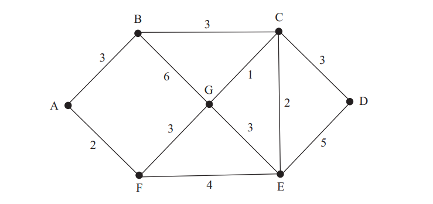

# Определение
Класс Prime принимает аргументы в виде коллекции Edge(ребер). Метод Calc высчитывает минимальный вес суммы ребер графа по [алгоритму Прима](https://ru.wikipedia.org/wiki/%D0%90%D0%BB%D0%B3%D0%BE%D1%80%D0%B8%D1%82%D0%BC_%D0%9F%D1%80%D0%B8%D0%BC%D0%B0) 
# Пример графа, который используется в Program
